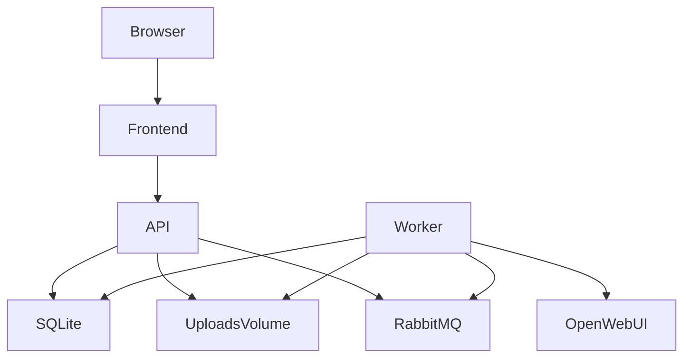

## Architecture (no Kubernetes manifests)

- **Containers (MVP)**:
  - `frontend`: static UI (Svelte + Vite build; served by nginx for prod; Vite dev server for dev)
  - `api`: FastAPI REST API (metadata + auth-free MVP)
  - `worker`: Celery worker (same image as `api`, different command)
  - `rabbitmq`: broker
- **Persistence (MVP)**:
  - SQLite on a named volume (swap to Postgres later without API surface changes)
  - Uploads on a named volume shared by `api` and `worker`

## Backend API shape

- **Uploads/records**
  - `POST /api/uploads` (multipart file + options: `summarize`, `action_items`, `model`, `prompt_id`s)
  - `GET /api/uploads` (list)
  - `PATCH /api/uploads/{id}` (rename display name)
  - `GET /api/uploads/{id}` (details incl transcript/summary/action items)
- **Jobs/progress**
  - `GET /api/jobs/{id}` (status, progress %, phase, timestamps)
  - Optional later: `GET /api/jobs/{id}/events` (SSE)
- **Prompts**
  - `GET /api/prompts` / `GET /api/prompts/{id}`
  - `PUT /api/prompts/{id}` (update prompt text)
  - Defaults loaded from `prompts/` on startup if DB empty

## Transcription pipeline (worker)

- Store upload metadata row + enqueue Celery task.
- Worker pipeline:
  - Normalize audio via `ffmpeg` to mono 16k WAV
  - Chunk via `ffmpeg -f segment -segment_time N` to enable incremental progress
  - Run `faster-whisper` on each chunk, collecting word/segment timestamps
  - Merge segments with chunk time offsets
  - Persist:
    - transcript text
    - segment rows (start/end/text)
    - duration/lang
  - If enabled:
    - call OpenWebUI endpoint `https://ollama.cloud.danmanners.com/api/v1/chat/completions`
    - generate summary and/or action items using selected model and prompt template

## OpenWebUI integration

- Use an OpenAI-compatible request body (`model`, `messages`, etc.) and parse `choices[0].message.content`.
- Config via env:
  - `OPENWEBUI_URL`
  - `OPENWEBUI_API_KEY` (optional)
  - `OPENWEBUI_DEFAULT_MODEL`

## Frontend UX

- Upload panel:
  - file picker/drag-drop
  - toggles: summary, action items
  - model selector (default from backend)
  - progress bar + job state
- Library panel:
  - list uploads (renamable)
  - transcript viewer with timestamps
  - summary + action items tabs when available
- Prompt editor:
  - choose prompt type (summary/action-items)
  - edit and save

## Repo layout (new)

- `compose.yaml`
- `backend/`
  - `app/` (FastAPI)
  - `worker/` (Celery tasks)
  - `prompts/` (default prompt templates)
  - `Dockerfile`
- `frontend/`
  - Svelte app
  - `Dockerfile`
- `README.md` + `.env.example`

## Dev workflow

- `docker compose up --build`
- Frontend proxies `/api` to backend in dev.

## Migration path to Kubernetes (design only)

- `frontend`, `api`, `worker`, `rabbitmq` become separate Deployments.
- Replace local volumes with PVC or object storage; replace SQLite with Postgres.